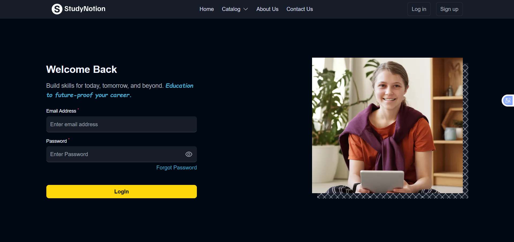
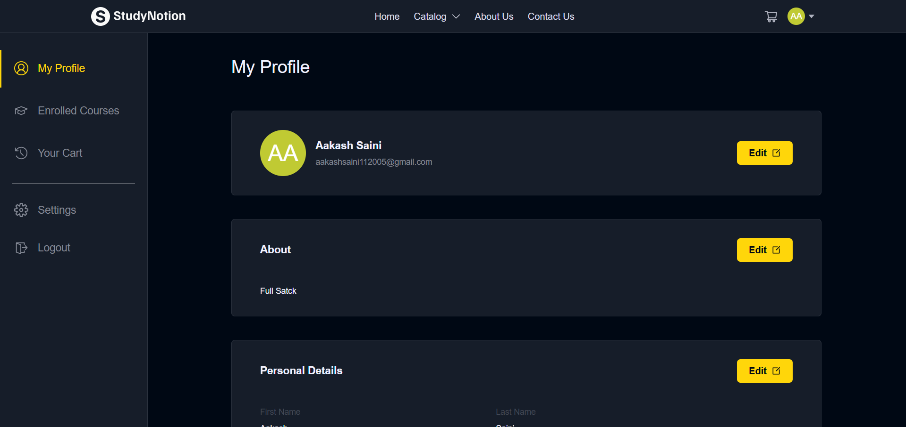
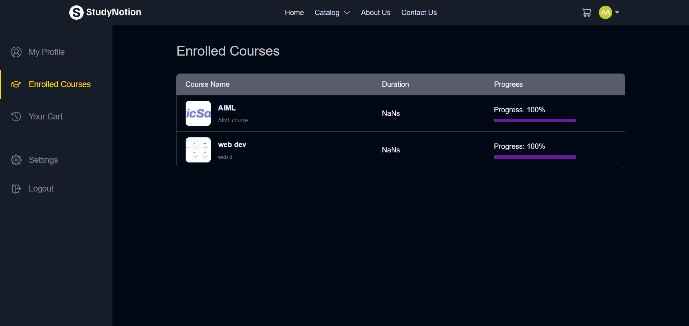

# StudyNotion

A full-stack EdTech platform where students can explore, purchase, and learn courses online while instructors can create and manage educational content.

---

## Live Demo

### Frontend (Vercel)

[https://study-notion-2sfd.vercel.app/](https://study-notion-2sfd.vercel.app/)

### Backend (Render)

[https://studynotion-vmff.onrender.com/](https://studynotion-vmff.onrender.com/)

---

# Features

## Authentication & Authorization

* User Signup & Login
* OTP Verification
* JWT Authentication
* Password Reset Functionality
* Role-Based Access Control

## Student Features

* Browse Courses
* Purchase Courses
* Razorpay Payment Integration
* Enroll in Courses
* Watch Lectures
* Track Learning Progress
* User Dashboard

## Instructor Features

* Create Courses
* Upload Course Content
* Manage Sections & Subsections
* Instructor Dashboard
* Course Analytics

## Platform Features

* Responsive UI
* Cloudinary Media Upload
* MongoDB Database Integration
* REST API Architecture
* Secure Backend APIs

---

# Tech Stack

## Frontend

* React.js
* Redux Toolkit
* Tailwind CSS
* Vite
* Axios

## Backend

* Node.js
* Express.js
* MongoDB
* Mongoose
* JWT
* Bcrypt

## Third Party Services

* Cloudinary
* Razorpay
* Nodemailer
* Render
* Vercel

---

# Project Structure

```bash
StudyNotion/
│
├── src/                # Frontend source code
├── public/             # Static assets
├── server/             # Backend source code
├── vercel.json         # Vercel routing configuration
├── package.json
└── README.md
```

---

# Installation & Setup

## Clone Repository

```bash
git clone https://github.com/aakash112005/StudyNotion.git
cd StudyNotion
```

---

## Frontend Setup

```bash
npm install
npm run dev
```

---

## Backend Setup

```bash
cd server
npm install
npm run dev
```

---

# Environment Variables

## Frontend `.env`

```env
VITE_API_URL=YOUR_BACKEND_URL/api/v1
```

## Backend `.env`

```env
PORT=
MONGODB_URL=
JWT_SECRET=
MAIL_USER=
MAIL_PASS=
CLOUDINARY_CLOUD_NAME=
CLOUDINARY_API_KEY=
CLOUDINARY_API_SECRET=
RAZORPAY_KEY=
RAZORPAY_SECRET=
FRONTEND_URL=
```

---








---

# Deployment

## Frontend Deployment

Deployed using Vercel.

## Backend Deployment

Deployed using Render.

---

# API Testing

You can test APIs using:

* Postman
* Thunder Client

---

# Future Improvements

* Real-time Chat
* AI Course Recommendations
* Certificates Generation
* Live Classes
* Dark Mode

---

# Author

## Aakash Saini

B.Tech CSE Student
Full Stack MERN Developer

GitHub:
[https://github.com/aakash112005](https://github.com/aakash112005)

---

# License

This project is built for learning and educational purposes.
